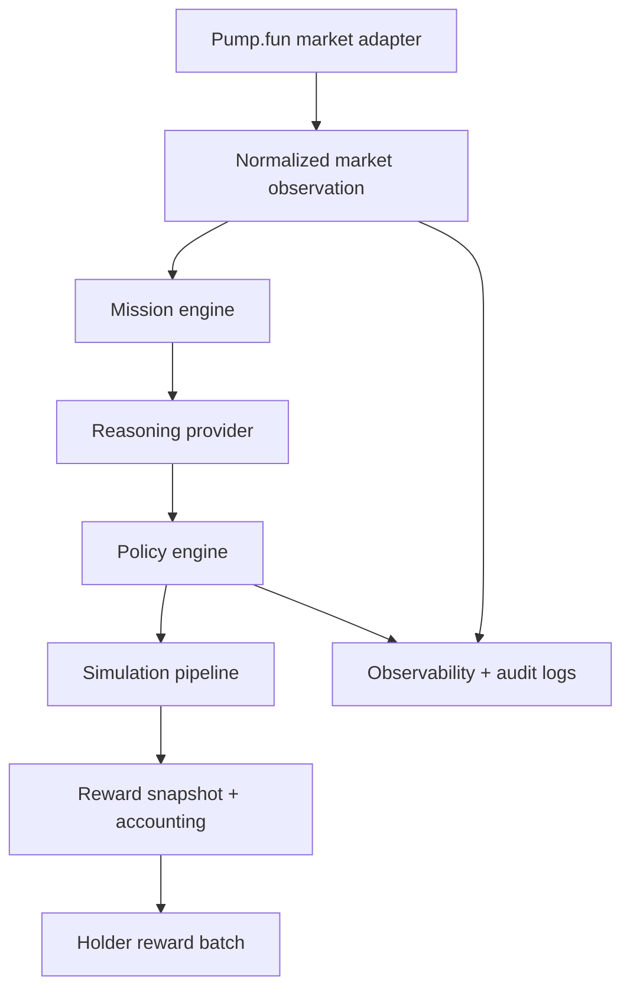
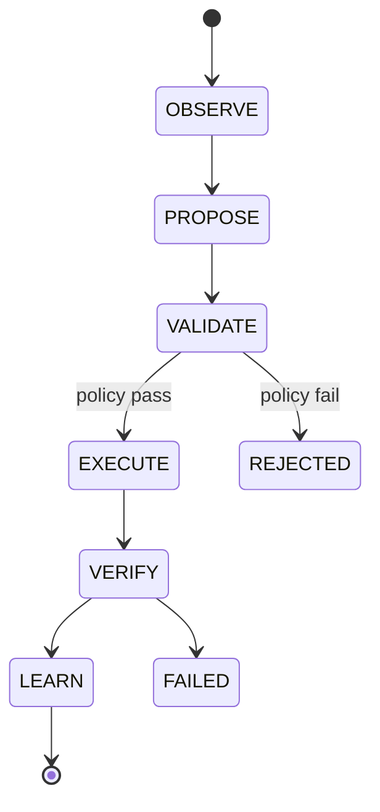
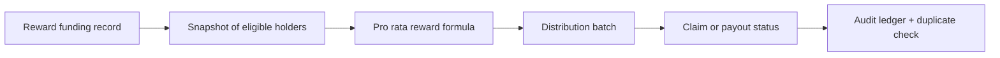
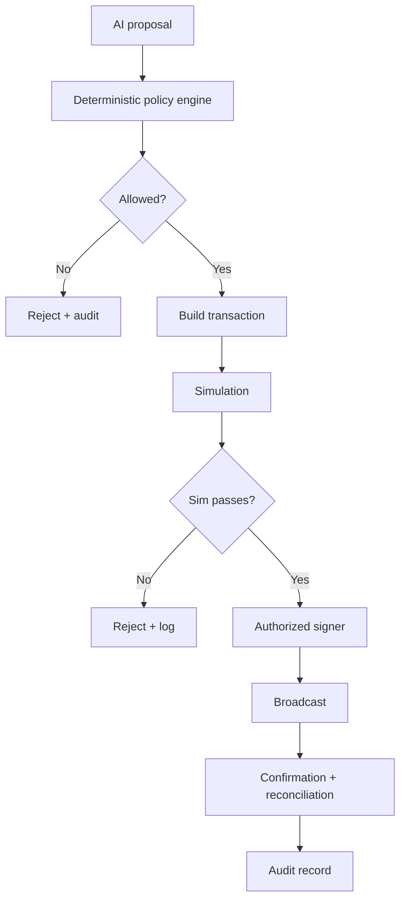

# Stupidinu

Stupidinu is an experimental autonomous memecoin protocol designed as a serious engineering sandbox around the absurd idea that every coin gets a mind. The project is intentionally split between implemented, simulated, and unimplemented components so the repository remains honest about what is live and what still requires external verification.

## Why this exists

The core question is whether a token paired with $USELESS can support a rules-based holder reward system while an autonomous agent observes market conditions and writes audit-friendly mission records. The project does not claim a working mainnet launch or a guaranteed return. Instead, it implements a conservative simulation stack that is ready to evolve toward a verified deployment path once external credentials and protocol integrations are available.

## System architecture



## Mission lifecycle



## Reward flow



## Transaction authorization flow



## Verified status

This repository intentionally implements the following as working code:

- Strict TypeScript modules with validation and typed interfaces.
- Market data adapter that normalizes Pump.fun-like payloads without fabricating unsupported endpoints.
- Reward accounting using integer arithmetic and duplicate-prevention logic.
- Policy engine with emergency pause and allowlist checks.
- A simulation runtime representing the agent lifecycle.
- Real tests covering reward math, stale observations, malformed payloads, and policy rejections.

The following remain intentionally disabled or simulated:

- Live Pump.fun API requests.
- Live TryAgency integration.
- Solana transaction signing or deployment.
- Actual holder reward transfers or wallet payouts.

## Project structure

```text
stupidinu/
├── README.md
├── LICENSE
├── CONTRIBUTING.md
├── SECURITY.md
├── .gitignore
├── .env.example
├── docker-compose.yml
├── package.json
├── tsconfig.json
├── tsconfig.base.json
├── apps/
│   └── agent-runtime/
├── packages/
│   ├── shared-types/
│   ├── market-data/
│   ├── reward-accounting/
│   ├── policy-engine/
│   ├── reasoning/
│   ├── agency-adapter/
│   └── solana-client/
├── docs/
├── .github/
└── tests/
```

## Installation

```bash
npm install
npm run build
npm run test
```

## Running the simulation runtime

```bash
npm --workspace apps/agent-runtime run start
```

Expected behavior: the runtime generates a mission, validates it through the policy engine, and prints structured JSON to the console without any wallet signing.

## Environment configuration

Copy the example file and adjust values as needed:

```bash
cp .env.example .env
```

The configuration file documents the runtime and security variables used by the project. The defaults keep the stack in simulation mode.

## Reward accounting model

The holder reward formula is implemented in integer arithmetic:

$$
holder\_reward = distributable\_rewards \times eligible\_holder\_balance / total\_eligible\_supply
$$

The repository enforces the following:

- No floating-point token math.
- Snapshot validation before reward calculations.
- Duplicate claim protection through a deterministic claim key.
- Dust forgiveness rules that are deterministic and auditable.
- A clear separation between recorded snapshots and execution paths.

This is documented as a holder reward mechanism, not a guaranteed investment return or guaranteed dividend.

## Pump.fun adapter and market data

A live Pump.fun integration is not assumed or fabricated. The project includes a typed adapter that normalizes market observations and rejects stale or malformed payloads. The interface is intentionally modeled to support a future verified Pump.fun API integration, but the default configuration remains read-only and simulation-based.

## TryAgency integration

The repository does not claim a verified TryAgency runtime. A dedicated adapter exists, but the default implementation explicitly returns a disabled health state. This keeps the architecture ready for a future verified framework integration without pretending it is live today.

## Security model

The authentication and execution flow is intentionally conservative:

1. AI generates a mission or proposal.
2. The policy engine evaluates the proposed action deterministically.
3. The transaction builder receives only approved actions.
4. Simulation runs before any live broadcast path is considered.
5. Audit logs record if a proposal is accepted, rejected, or skipped.

The project does not expose private keys, RPC credentials, or model API keys in source code or logs. All financial path definitions are explicit and require explicit configuration.

## Local Solana deployment

The repo contains a minimal Docker Compose scaffold intended for local simulation and testing. It is not a production deployment manifest.

```bash
docker compose up -d
```

This is a local-only scaffold and should not be used with real funds or production keys.

## Known limitations

- No live Pump.fun endpoint has been fabricated or claimed.
- No TryAgency SDK integration is assumed to exist.
- No Solana wallet signing or mainnet deployment is enabled by default.
- The repository intentionally documents unverified integrations instead of pretending they are working.
- The codebase is designed as an engineering foundation, not as a complete audited financial product.

## Current implementation status

| Area | Status |
| --- | --- |
| Core TypeScript monorepo | Completed |
| Market data validation | Completed |
| Reward math and snapshots | Completed |
| Policy engine | Completed |
| Simulation agent runtime | Completed |
| Live Pump.fun integration | Unimplemented |
| TryAgency integration | Unimplemented |
| Solana transaction execution | Simulated only |
| Audit-grade mainnet deployment | Not ready |

## Roadmap

1. Verify actual Pump.fun and Solana APIs in a live environment.
2. Add a real database-backed mission store.
3. Expand policy checks and audit logging.
4. Add verified onchain reward program integration.
5. Add a real scheduler and health endpoints.
6. Harden CI and security review before any production deployment.

## Contributing

Please read [CONTRIBUTING.md](CONTRIBUTING.md) and [SECURITY.md](SECURITY.md) before making changes.

## License

The project is released under the MIT license.
